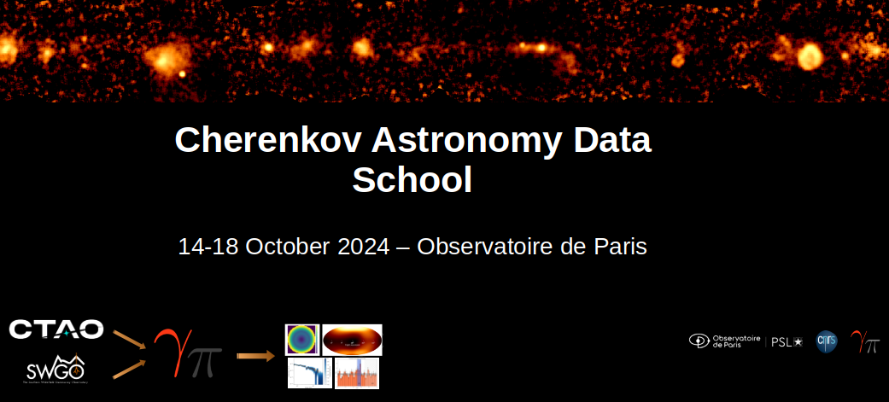

# Cherenkov Astronomy Data School, Paris, 2024

**Disclaimer** : still under construction!

## Table of contents
1. [Overview](#scope)
2. [Introduction to high-energy astrophysics](#HEA)
3. [Introduction to TeV gamma-ray detection](#HEO)
4. [Introduction to TeV data analysis](#tev-data)
5. [Gammapy hands-on sessions](#hands-on)
6. [User session](#user)
7. [Legal notice](#notice)

## 1. Overview
One-week school on gamma-ray astronomy organized at the Observatoire de Paris, designed for PhD 
students/postdocs/researchers eager to learn about gamma-ray astronomy data and the specific challenges of ground-based
Cherenkov observations and of high-energy data analysis. The science analysis tool [Gammapy](https://gammapy.org/), 
chosen by/for the international Cherenkov Telescope Array Observatory [CTAO](https://www.ctao.org/), will be presented. 
Lectures and hands-on sessions (beginners and experienced users) will take place on two sites of the Observatoire de 
Paris, in Paris and Meudon.

The indico page is https://indico.obspm.fr/event/2480/overview.

## 2. Introduction to high-energy astrophysics

### Radiative processes (TBC)
Made by S. Gabici (APC, Paris) - Monday 14th, 14h/15h30, Salle Denisse at the Observatoire de Paris
Link to the presentation

### Galactic sources (TBC)
Made by S. Gabici (APC, Paris) - Monday 14th, 16h/17h30, Salle Denisse at the Observatoire de Paris
Link to the presentation

### Extragalactic sources (TBC)
Made by M. Cerruti (APC, Paris) - Tuesday 14th, 9h30/11h00, Salle du Conseil at the Observatoire de Paris
Link to the presentation

## 3. Detection and reconstruction of extensive air showers
Made by Federica Bradascio (IJCLab, Orsay) - Tuesday 14th, 11h15/12h45, Salle du Conseil at the Observatoire de Paris

[Link to the presentation](https://github.com/user-attachments/files/17380886/fbradascio_eas_detection_cads_school_2024.pdf)

## 4. Introduction to TeV data analysis
Made by Jonathan Biteau (IJCLab, Orsay)

[NPAC Master course](https://github.com/user-attachments/files/17377930/NPAC_Statistics-1.pdf)

[Link to the presentation](https://github.com/user-attachments/files/17377941/CADS_Statistics_2024.pdf)

### From detection to high-level reconstruction - A statistical view on gamma-ray sources - 1

### From detection to high-level reconstruction - A statistical view on gamma-ray sources - 2

## 5. Gammapy hands-on sessions
Location: Meudon

The hands-on session will be organised for two different groups:
- the beginner users : [material page](Beginners_handson/README.md)
- the advanced users : [material page](Advanced_handson/README.md)

## 6. User session
Location: Paris

Questions and discussion on specific projects:
- **Stellar arachnology at the highest energies: Identifying potential targets to CTAO**, by Livia Silva Rocha

Spider pulsars are binary systems where a low-mass companion orbits a millisecond pulsar in a short-period orbit (less 
than one day). These systems are categorized as black widows (m_c << 0.1 M_\odot) or redbacks  (m_c ~ 0.1 - 0.5 M_\odot),
depending on the companion’s mass. The presence of long eclipses in these systems indicates intrabinary material, along 
with an intrabinary shock, which offers a promising environment for particle acceleration and gamma-ray emission at TeV 
energies. This work employs the Gammapy package to analyze available data on spider systems, primarily from Fermi-LAT, 
and plan to integrate a radiative model developed with the UMBRELA code to extract the spectral model of each binary. 
Simulated observations of the full sample of spider systems using the CTAO under its Alpha Configuration, based on the 
computed spectral models, will then help identify the most promising sources for detection with the next generation of 
Imaging Atmospheric Cherenkov Telescopes (IACTs). This presentation will cover preliminary results, its challenges, and 
the next steps in the analysis.

- XXX

## 7. Legal notice
All contributors of these pages has agreed with the term of the [BSD-3-Clause license](./LICENSE) of this repository.

In addition, all material will be archived into the universal [Software Heritage](https://www.softwareheritage.org/) 
archive. The SWHID identification number is 
[swh:1:dir:1765812ea4eb1772b6e7d3cfd8ba614e41c05f34](https://archive.softwareheritage.org/swh:1:dir:1765812ea4eb1772b6e7d3cfd8ba614e41c05f34;origin=https://github.com/bkhelifi/CADS_2024;visit=swh:1:snp:7777427b11073033caf0c0a513e00efbf9ed6b26;anchor=swh:1:rev:012705bd0e8d7eb5dcb796ccaa6dc4e498fa0928).

